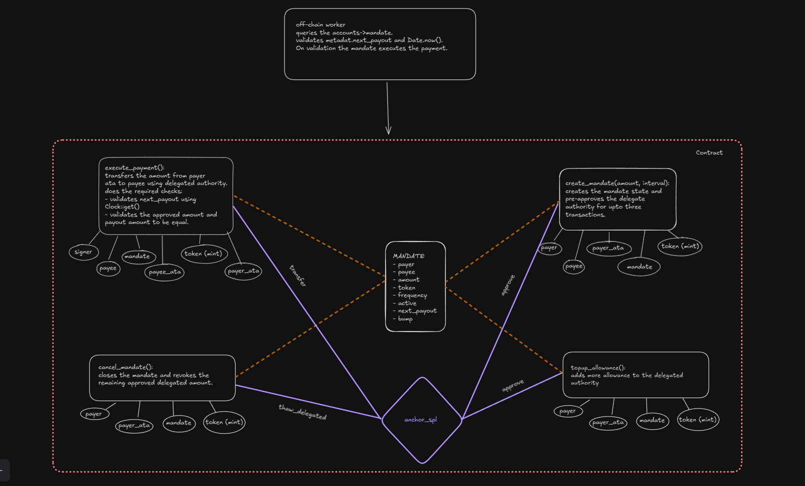

# DMANDATE - Decentralized Recurring Payments on Solana

DMANDATE is a Solana-based protocol for decentralized recurring payments. Users pre-approve a PDA to transfer tokens (e.g., USDC) without locking funds. A backend processes payments at scheduled intervals, ensuring self-custody and transparency. Ideal for subscriptions, salaries, and bills, DMANDATE offers a trustless, non-custodial alternative to traditional e-mandates.



## Table of Contents

- [Features](#features)
- [Repository Structure](#repository-structure)
- [Smart Contract](#smart-contract)
- [Backend Mandate Processor](#backend-mandate-processor)
- [CLI Tool](#cli-tool)
- [Installation & Setup](#installation--setup)
- [Development](#development)
- [Testing](#testing)
- [Deployment](#deployment)

## Features

- **Non-custodial recurring payments**: Users maintain control of their funds at all times
- **Programmable payment schedules**: Set custom frequencies for payment execution
- **Transparent on-chain history**: All payments and mandates are recorded on the Solana blockchain
- **Automated payment processing**: Backend service checks and executes due payments
- **User-friendly CLI**: Command-line interface for managing mandates and payments
- **Web3 friendly**: Built natively for Solana's SPL tokens

## Repository Structure

```
dmandate/
├── backend/             # Backend payment processor service
│   ├── idl/             # Anchor IDL for the dmandate program
│   └── src/             # Source code for the mandate processor
├── cli/                 # Command-line interface tool
├── programs/            # Solana smart contracts written in Rust
│   └── dmandate/        # Main dmandate program
└── tests/               # Integration tests for the program
```

## Smart Contract

The DMANDATE smart contract is built using the Anchor framework and includes the following key instructions:

- `register_user`: Registers a user in the system
- `create_mandate`: Creates a new recurring payment mandate
- `execute_payment`: Executes a payment for an active mandate
- `cancel_mandate`: Cancels an active mandate
- `reapprove_mandate`: Updates the approval amount for an existing mandate
- `close_payment_history`: Closes a payment history record to reclaim rent

## Backend Mandate Processor

The backend service monitors active mandates on the Solana blockchain and automatically executes payments when they are due.

### Features

- Periodic checking of all active mandates
- Automatic payment execution for due mandates
- Error handling for failed payments
- Configurable settings via environment variables or config file
- Logging of all operations

### Configuration

The mandate processor can be configured with the following options:

| Option         | Environment Variable   | Description                                    | Default                                      |
| -------------- | ---------------------- | ---------------------------------------------- | -------------------------------------------- |
| Check Interval | `CHECK_INTERVAL`       | How often to check for payable mandates (ms)   | 60000 (1 min)                                |
| RPC URL        | `RPC_URL`              | Solana RPC URL                                 | http://localhost:8899                        |
| Keypair Path   | `KEYPAIR_PATH`         | Path to keypair JSON file                      | ~/.config/solana/id.json                     |
| Program ID     | `PROGRAM_ID`           | DMANDATE program ID                            | BXXJENjyLn4ZGYfkDpSxZ6Vt7TcxW7BQJgWaGiQGbfed |
| Batch Size     | `BATCH_SIZE`           | Max mandates to process in one batch           | 100                                          |
| Buffer Time    | `BUFFER_TIME`          | Time buffer before scheduled payment (seconds) | 60                                           |
| Log Level      | `LOG_LEVEL`            | Logging level (debug, info, warn, error)       | info                                         |
| Notifications  | `ENABLE_NOTIFICATIONS` | Enable payment notifications                   | false                                        |

## CLI Tool

The DMANDATE CLI tool provides a convenient way to interact with the smart contract.

See the [CLI README](cli/README.md) for detailed usage instructions.

## Installation & Setup

### Prerequisites

- Node.js v14+ and npm
- Rust and Cargo
- Solana CLI tools
- Anchor Framework

### Setting Up the Project

1. Clone the repository:

   ```bash
   git clone https://github.com/yourusername/dmandate.git
   cd dmandate
   ```

2. Install dependencies:

   ```bash
   npm install
   ```

3. Build the Solana program:

   ```bash
   anchor build
   ```

4. Generate the program ID (if needed):

   ```bash
   solana-keygen new -o target/deploy/dmandate-keypair.json
   anchor keys list
   ```

   Update the program ID in `Anchor.toml` and `lib.rs`

5. Setup the backend processor:

   ```bash
   cd backend
   npm install
   ```

6. Setup the CLI:

   ```bash
   cd cli
   npm install
   npm link  # Optional, to use CLI globally
   ```

7. Create a `.env` file in the backend directory:
   ```
   RPC_URL=https://api.devnet.solana.com
   KEYPAIR_PATH=/path/to/your/keypair.json
   CHECK_INTERVAL=60000
   BUFFER_TIME=60
   LOG_LEVEL=info
   ```

### Running the Mandate Processor

```bash
cd backend
npm run build
node dist/index.js
```

Or use a process manager like PM2:

```bash
npm install -g pm2
pm2 start dist/index.js --name mandate-processor
```

## Development

### Local Development Environment

1. Start a local Solana validator:

   ```bash
   solana-test-validator
   ```

2. Deploy the program to the local network:

   ```bash
   anchor deploy
   ```

3. Run the mandate processor against local network:
   ```bash
   cd backend
   RPC_URL=http://localhost:8899 npm run start
   ```

### Making Changes to the Smart Contract

1. Modify code in `programs/dmandate/src/`
2. Build with `anchor build`
3. Update IDL if needed: `anchor idl parse -f programs/dmandate/src/lib.rs -o target/idl/dmandate.json`
4. Copy the new IDL to the backend: `cp target/idl/dmandate.json backend/idl/`
5. Deploy: `anchor deploy`

## Testing

### Smart Contract Tests

Run the test suite:

```bash
anchor test
```

### Backend Tests

```bash
cd backend
npm test
```

## Deployment

### Program Deployment

1. Build the program:

   ```bash
   anchor build
   ```

2. Deploy to your desired network:

   ```bash
   anchor deploy --provider.cluster devnet  # For devnet
   # OR
   anchor deploy --provider.cluster mainnet  # For mainnet
   ```

3. Verify the program ID and update configuration as needed.

### Backend Deployment

1. Build the backend:

   ```bash
   cd backend
   npm run build
   ```

2. Deploy using your preferred method (PM2, Docker, cloud services).

3. Make sure to set the appropriate environment variables for your deployment.

## License

[MIT License](LICENSE)
